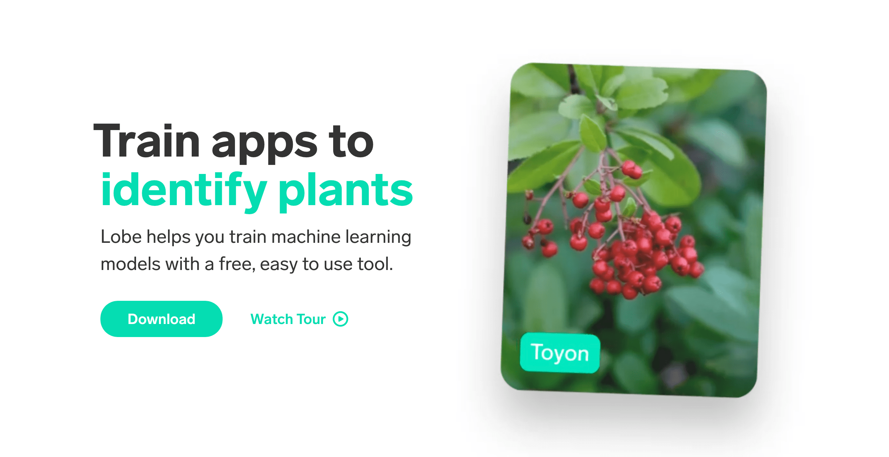

<!-- ABOUT THE PROJECT -->

## Lobe

<a href="https://lobe-ia.vercel.app" markdown="1">

</a>

Web application for machine learning.

https://lobe-ia.vercel.app

### Built With

- Next
- Typescript
- Tailwind
- Jest

<!-- GETTING STARTED -->

## Getting Started

To run the project follow these simple steps.

### Installation

1. Clone the repo

```sh
git clone https://github.com/Nicolas-dlb/lobe
```

2. install dependances

```sh
npm install
```

3. run the project

```sh
npm run dev
```

<!-- CONTACT -->

## Contact

Nicolas Dubois - [@Linkedin](https://www.linkedin.com/in/nicolasdlb) - nicolas_db@outlook.fr

Project Link: [https://github.com/Nicolas-dlb/lobe](https://github.com/Nicolas-dlb/lobe)

<!-- MARKDOWN LINKS & IMAGES -->
<!-- https://www.markdownguide.org/basic-syntax/#reference-style-links -->

[linkedin-url]: https://www.linkedin.com/in/nicolasdlb
[preview]: ./public/assets/preview.png
